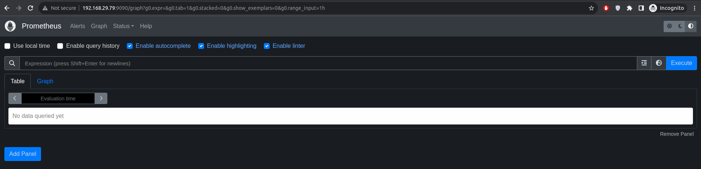
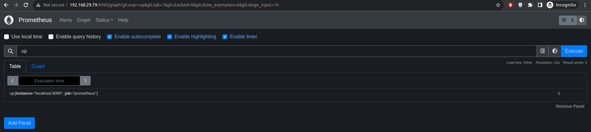
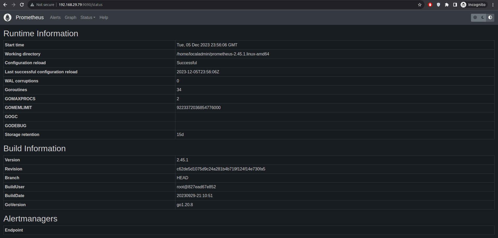
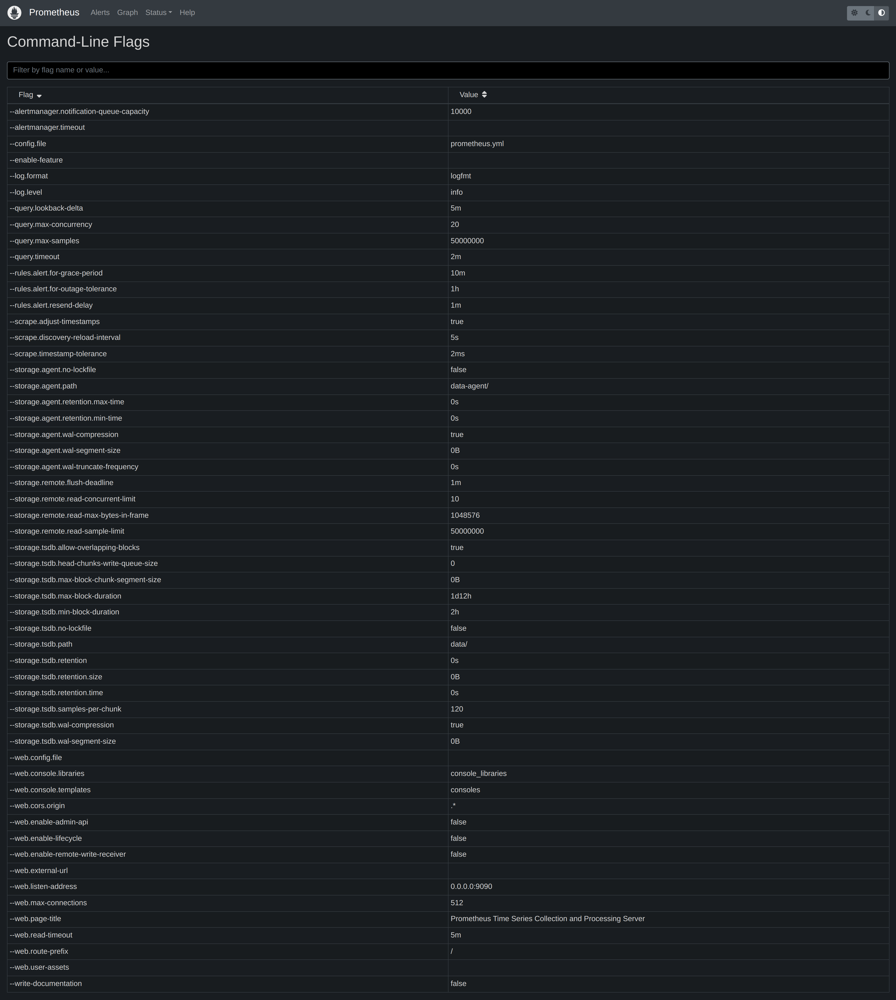
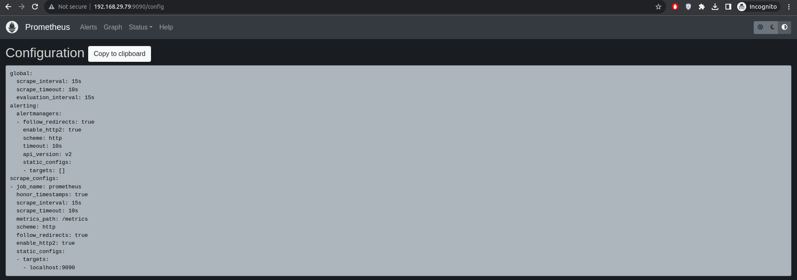
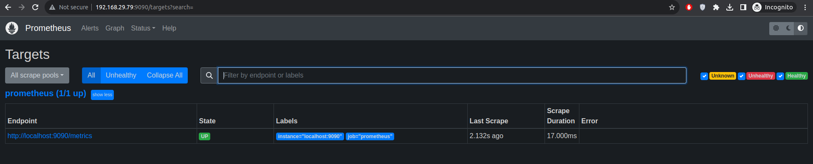

# Monitoring &mdash; Prometheus & Grafana

Welcome to the [Monitoring &mdash; Prometheus & Grafana](#monitoring--prometheus--grafana) repository! Explore hands-on exercises/concepts and configuration examples to understand monitoring with Prometheus and Grafana. Find documentation to guide your learning journey. 🚀📊


<details>
<summary>

## Setup & Installation 🔧💻

</summary>

1. Download [VirtualBox](https://www.oracle.com/in/virtualization/technologies/vm/downloads/virtualbox-downloads.html) (or follow instructions to [install virtual box in ubuntu](https://tecadmin.net/install-virtualbox-on-ubuntu-20-04/))
2. Download [Ubuntu Server Image `18.04`](https://releases.ubuntu.com/18.04/).
3. Open Virtual Box and allocate 10GB fixed disk, 2 CPUs, and mount the image as Bridge (adapter) in the Network tab.
4. Now while installing Ubuntu Server, make sure to install `OpenSSH` (and installing `prometheus` is optional).
5. Once installation is completed and you're logged in to your user (note down the IP for remote access), just update and upgrade your vm:

   ```sh
   sudo apt-get update && sudo apt-get upgrade
   ```

6. Before the next step, `poweroff` the vm and start the ubuntu server vm in headless mode.
7. Download, Install, and Open [VSCode](https://code.visualstudio.com/download):
   1. Install the [`Remote SSH`](https://marketplace.visualstudio.com/items?itemName=ms-vscode-remote.remote-ssh) extension from Microsoft.
   2. `Ctrl + Shift + P` and type in `Remote-SSH: Add new SSH Host...`, and click on the option. A prompt for username and IP will be asked where you've to type in:

      ```sh
      ssh <username>@<ubuntu-server-ip> # make sure the ubuntu server vm is started in headless mode
      ```

   3. Choose a configuration file for configuring SSH keys and then the `Remote-SSH` extension will prompt for password, once you type it in, a dialog to `Confirm` will be asked where you've to click `Confirm` to connect to the vm via VSCode.
   4. You can now access your entire server vm via VSCode, and your explorer in VSCode should resemble the following:

      
8. Download `docker` from <https://get.docker.com> as follows:

   ```sh
   # Download Docker Script
   sudo curl -fsSL https://get.docker.com -o install-docker.sh

   # Do a dry-run (optional)
   sudo sh install-docker.sh --dry-run

   # Install Docker
   sudo sh install-docker.sh

   # Add the current user to 'docker' group
   sudo usermod -aG docker ${USER}

   # Use docker and check running containers
   docker ps # this command won't work unless the user is `sudo`
   ```

</details>

<details>
<summary>

## Monitoring Principles & How Prometheus Works

</summary>

<details>
<summary>

### DevOps LifeCycle ♻️

</summary>


- `Plan` & `Code` together is known as `Continuos Development`,
- `Build` & `Test` together is known as `Continuos Integration` &mdash; sometimes also called _Heart of DevOps_,
- `Release` & `Deploy` together is known as `Continuous Deployment`, and
- `Operate` & `Monitor` together is known as `Continuos Monitoring`.

`Continuos Monitoring` is considered the most crucial stage in the DevOps LifeCycle as in this stage we can check if the system is running in accordance to the standards that are expected by the end-users, and here's where we can check the health of the system and application performance.

With these valuable metrics, we are then able to add further benefit to the overall performance to our environment such as reducing support costs, improving productivity, and increasing system reliability, and from the analytics and reporting generated from the `monitoring` stage, we can have a clear vision for further planning of development of the application and system.

`Monitoring` has the following 5 stages:


</details>

<details>
<summary>

### Prometheus Architecture 🔥📝

</summary>

- Prometheus is a monitoring solution with a time-series database that can be queried using [`Prom-QL`](https://prometheus.io/docs/prometheus/latest/querying/basics/).
- It's a Single Static Binary built in Golang.
- It can pull metrics from many different sources such as &mdash; network, devices, hosts, services, and applications.
- Application instrumentation with many different languages such as `golang`, `python`, `javascript`, `java`, `ruby`, etc.
- A single prometheus server can handle millions of metric ingestions per second.
- Many work-arounds for a [pull-based service](https://www.alibabacloud.com/blog/pull-or-push-how-to-select-monitoring-systems_599007), as it's widely used and supported by the DevOps community.


</details>
</details>

<details>
<summary>

## Install & Setting Up Prometheus Server 🔥🖱️🔧

</summary>

<details>
<summary>

### Running Prometheus in Terminal 🧑‍🚒🖥️🖱️

</summary>

> Before doing anything, please [take a snapshot of the Ubuntu Server VM in VirtualBox](https://www.baeldung.com/linux/virtualbox-snapshots) to make sure that the current state is preserved.

1. Open <https://prometheus.io/download/> and `Copy link address` for **LTS** version.
2. Start the ubuntu-server vm in headless mode and connect via VSCode (mentioned in detail in `Setup & Installation`'s Step-7).
3. Download the `prometheus` package via `wget` as follows:

   ```sh
   wget https://github.com/prometheus/prometheus/releases/download/v2.45.1/prometheus-2.45.1.linux-amd64.tar.gz
   ```

4. Untar the downloaded tarbal:

   ```sh
   gunzip prometheus-2.45.1.linux-amd64.tar.gz && tar xvf ./prometheus-2.45.1.linux-amd64.tar
   ```

5. Run `prometheus`:

   ```sh
   cd prometheus-2.45.1.linux-amd64 && ./prometheus
   ```

6. You should be able to access `prometheus` server from `<ip-addr>:9090` in your browser. If the `ip-addr` is `192.168.29.79`, then you can access the `prometheus` server dashboard from the browser by going to `192.168.29.79:9090`. By default, `:9090` is used as the port for `prometheus` server job, but this can be changed via `192.168.29.79:9090/config` or `prometheus.yml` file.

   

7. We can issue a command to `prometheus` via the `Expression` box, and the command we'll give is: `up`, which by default scrapes the `prometheus` job, and gives an output that resembles the following:

   

   `value` of `1` means that the scrape was successful.

8. We can find more useful details in the following sections:
   1. `Status` > `Runtime & Build Information` \[or\] go to `<ip-addr>:9090/status`

      

   2. `Status` > `Command-Line Flags` \[or\] go to `<ip-addr>:9090/flags`

      

   3. `Status` > `Configuration` \[or\] go to `<ip-addr>:9090/config`

      

      The configuration can be copied and shared with anyone, and then anyone else using `prometheus` will be able to scrape the same targets as we're scraping.

   4. `Status` > `Targets` \[or\] go to `<ip-addr>:9090/targets`

      

      By default, the scraped targets the `prometheus` job itself, so the data shown in the image above is for `prometheus` job.

</details>
</details>
